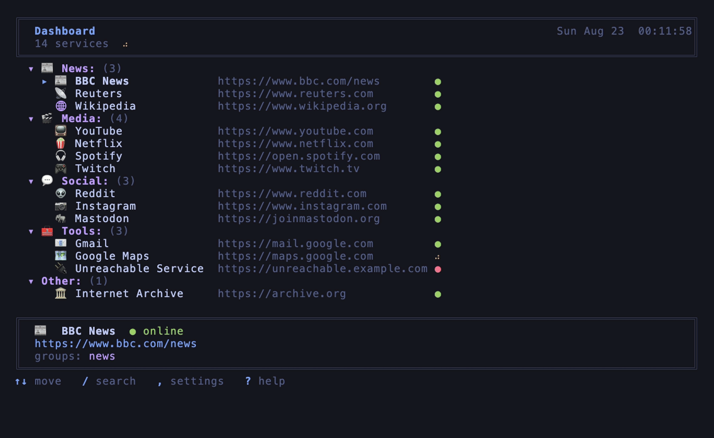

# Homepage

A minimal, keyboard-friendly homepage dashboard with web and CLI frontends.



*(the CLI TUI — regenerate with `make demo`)*

## Features

- Clean, dark-themed UI with light mode option
- Dynamic group filtering (External/Local/All or custom groups)
- **Categorized View**: Services are grouped with headers in "All" mode
- **Intelligent Search**: Type-to-jump with auto-scroll to selection
- **Drag-and-Drop**: Reorder services (persists in browser)
- **Mobile Friendly**: Long-press (500ms) with haptic feedback to copy URL
- **Customizable**: Extensive settings panel for theme, clock, and layout
- **CLI TUI**: Terminal-based interface with health checks, search, and color themes

## Quick Start

```bash
# Edit services
vim services.yml

# Build everything (web + CLI)
make build

# Build only web
make build-html

# Build only CLI
make build-cmd

# Open web dashboard in browser
make run-web

# Launch CLI TUI
make run-cli

# CLI with custom config
./output/tui path/to/services.yml

# Generate example and open in browser
python3 web/build.py --open
```

## Configuration

Edit `services.yml`:

```yaml
title: My Homepage     # Browser tab title
header: Dashboard       # Header display (optional, defaults to title)

# Define groups
groups:
  - id: external
    name: External
  - id: local
    name: Local

# List your services
services:
  - name: ServiceName
    url: https://service.example.com
    icon: 🛠
    groups: [external]

  - name: LocalService
    url: http://localhost:8080
    icon: 🏠
    groups: [local]
```

### Service Configuration

- **url** (required): Service URL
- **icon**: Emoji or text icon
- **groups**: List of group IDs. Services without groups fall into "No Group"
- Services with no groups default to appearing in "All" group only

### Groups

Groups are defined in the `groups` section with:
- **id**: Unique identifier (used in service `groups` array)
- **name**: Display name (shown in group selector)

An implicit "All" group is automatically added, showing all services categorized by their primary group.

### Settings

Click the ⚙ button or press `,` to access:
- **Theme**: Toggle light/dark mode
- **Group**: Cycle through groups
- **Clock**: Switch between 12h/24h format
- **Date**: Show/hide date display
- **Search**: Show/hide search bar
- **Icons**: Show/hide service icons
- **Compact**: Smaller cards for more services
- **Clear custom order**: Reset service order to default
- **Reset all settings**: Clear all saved preferences

### Keyboard Shortcuts

- **Type**: Filter services and jump to first result (auto-scrolls to view)
- **Arrow Keys**: Navigate filtered results (or settings when open)
- **Enter**: Open selected service in browser (search + Enter opens first match)
- **Esc**: Clear search / Close settings / Close hints
- **/**: Search / filter
- **,**: Toggle settings panel
- **?**: Show keyboard shortcuts overlay

### Mobile

- **Tap**: Navigate to service
- **Long Press** (500ms): Copy URL to clipboard (includes haptic feedback)
- **Drag**: Reorder services

## Deployment

```bash
make build
# Upload output/index.html to your web server
```

## Files

```
.
├── web/
│   ├── build.py             # Build script (requires PyYAML)
│   └── src/
│       ├── template.html    # HTML template
│       ├── style.css        # Styles
│       ├── script.js        # JavaScript
│       └── health.js        # Health check module
├── cli/
│   ├── tui/
│   │   └── main.go          # Go TUI (bubbletea/lipgloss)
│   ├── go.mod
│   └── go.sum
├── services.yml             # Service definitions
├── services.example.yml     # Example config
├── demo/
│   ├── demo.tape            # VHS script for the TUI demo gif
│   └── demo.gif             # Generated demo (make demo)
├── Makefile                 # Build orchestration
├── output/                  # Generated files (gitignored)
│   ├── index.html
│   ├── example.html
│   └── tui
├── AGENTS.md
└── README.md
```
